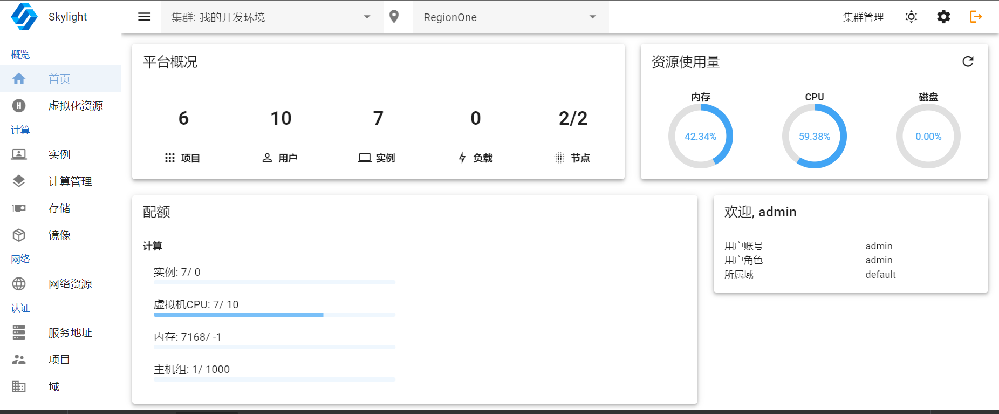

# vuetify-stack-board

Openstack Dashboard with Vuetify

预览



## 1 环境要求

+ python >= 3.9

## 2 安装

### 2.1 安装wheel包

1. 安装gettext：
   + Ubuntu：`apt get-install gettext`
   + Centos：`yum install gettext`
   + windows: 无需安装
2. 构建wheel包：`python3 setup.py bdist_wheel`
3. 安装：`pip3 install dist/<THE_PATH_OF_WHEEL_FILE>`

*安装成功后，可执行 `vastackboard --help` 命令查看帮助信息*

### 2.2 在docker容器中运行

1. 构建wheel包：`python3 setup.py bdist_wheel`

2. 构建镜像 `python .\install\build.py dist/<THE_PATH_OF_WHEEL_FILE>`

3. 启动容器
   
   ```shell
   IMAGE=vstackboard:<VERSION>
   mkdir -p /var/log/vstackboard
   docker run -itd -p 80:80 --name vstackboard ${IMAGE}
   ```

### 2.3 直接运行（开发者模式）

1. 进入项目目录，设置环境变量
   
   + powershell: `$env:PYTHONPATH="./"`
   + cmd: `set PYTHONPATH=./`
   + shell: `export PYTHONPATH=./`

2. 启动后端服务: `python .\vstackboard\cmd\vsb.py --dev`
2. 启动前端服务: `npm run serve`


*更多用法参考帮助信息。*

## 更多

[ChangeLog](./doc/ChangeLog.md)